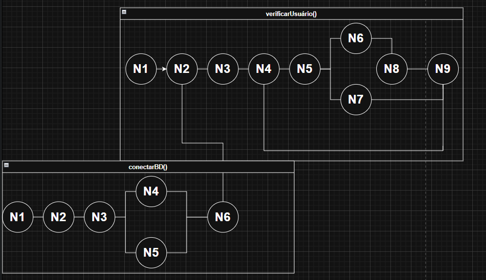

# UX-UI-e-Teste-de-Software

#  Teste de Caixa Branca  
Este documento apresenta a análise do código da classe `User`, incluindo grafo de fluxo, complexidade ciclomática e caminhos básicos dos métodos `verificarUsuario()` e `conectarBD()`.

---

#  1. Grafo de Fluxo – verificarUsuario()

### **Nós**
 N1 – Início do método  
 N2 – Chama `conectarBD()`  
 N3 – Monta a query SQL  
 N4 – Entra no bloco `try`  
 N5 – Executa a query  
 N6 – Verifica se `rs.next()`  
 N7 – Atribui valores quando há resultado  
 N8 – Bloco `catch`  
 N9 – Retorna o valor de `result`

### **Fluxo (Arestas)**
  N1 → N2
  N2 → N3
  N3 → N4
  N4 → N5
  N5 → N6
  N6(true) → N7 → N9
  N6(false) → N9
  N4(error) → N8 → N9

  
---

#  2. Grafo de Fluxo – conectarBD()

### **Nós**
 N1 – Início do método  
 N2 – Cria o objeto Connection  
 N3 – Entra no bloco `try`  
 N4 – Tenta realizar a conexão  
 N5 – Bloco `catch`  
 N6 – Retorna o objeto Connection  

### **Fluxo (Arestas)**
  N1 → N2
  N2 → N3
  N3 → N4
  N3(error) → N5
  N4 → N6
  N5 → N6

  
---

#  3. Complexidade Ciclomática

A fórmula utilizada foi:
M = E – N + 2P

---

##  **Método verificarUsuario()**
 Nós (N): 9  
 Arestas (E): 10  
 Componentes (P): 1  

M = 10 – 9 + (2 × 1)
M = 3

### **Complexidade ciclomática: 3**

---

## ✔ **Método conectarBD()**
 Nós (N): 6  
 Arestas (E): 6  
 Componentes (P): 1
  
M = 6 – 6 + (2 × 1)
M = 2

### **Complexidade ciclomática: 2**

---

##  **Complexidade total da classe User**
3 (verificarUsuario) + 2 (conectarBD) = 5

---

#  4. Caminhos Básicos

Os caminhos básicos foram identificados com base na complexidade ciclomática de cada método.

---

## ✔ **Método verificarUsuario() – 3 Caminhos**

### **Caminho 1 – Usuário encontrado**
N1 → N2 → N3 → N4 → N5 → N6(true) → N7 → N9

### **Caminho 2 – Usuário não encontrado**
N1 → N2 → N3 → N4 → N5 → N6(false) → N9

### **Caminho 3 – Ocorre exceção**
N1 → N2 → N3 → N4(error) → N8 → N9

---

## ✔ **Método conectarBD() – 2 Caminhos**

### **Caminho 1 – Conexão bem-sucedida**
N1 → N2 → N3 → N4 → N6

### **Caminho 2 – Erro ao conectar**
N1 → N2 → N3 → N5 → N6

---

#  Conclusão

A análise completa da classe `User` demonstra:
- Fluxos claros de execução
- Pontos de decisão bem identificados
- Complexidade ciclomática baixa (boa manutenibilidade)
- Caminhos básicos bem definidos para testes

Toda a documentação atende aos requisitos da atividade de **Caixa Branca (White Box Testing)**.

---

